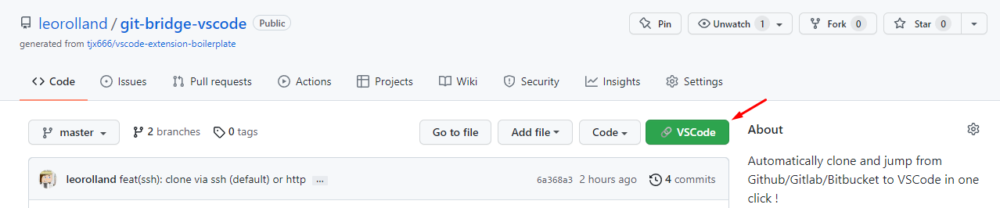

<p align="center">
  
</p>

# Git Bridge : Browser extension

## Features 
- Adds a "VSCode" button in Github.com, Gitlab and Bitbucket
- Jump from your browser to VSCode in one click
- Automatically clone the repo if it doesn't exist locally (at the right place !)
  - For example, this repo will be cloned at :
  ```sh
  $HOME/repositories/github.com/leorolland/git-bridge-browser
  ```
  You can edit the path in the VSCode GitBridge extension settings.

 
## Source code

All the code from this repository comes from the great [Gitpod extension](https://github.com/gitpod-io/browser-extension) and has been slightly edited for Git Bridge.


## Build

### Chrome & Firefox

```
yarn install && yarn build && yarn package
```

### Safari

#### ⚠️ A machine running macOS and [Xcode 12+](https://developer.apple.com/xcode/) installed is required!

First, run the following to install dependencies and build the web extension:

```
yarn install && yarn build && yarn package
```

Then run the `build:safari` command to build the Safari extension around the web extension:

```
yarn build:safari
```


Hit `enter` when presented with this screen.

`Xcode` will open the `GitBridge.xcodeproj` automatically if it's installed.

## Test

[Build](#build) the extension and
* unzip `gitbridge.xpi` and load it as [“unpackaged extension” (Chrome)](https://developer.chrome.com/extensions/getstarted) or
* load `gitbridge.xpi` as [“temporary add-on” (Firefox)](https://blog.mozilla.org/addons/2015/12/23/loading-temporary-add-ons/) or
* open `GitBridge/GitBridge.xcodeproj` and run the project with `cmd` + `r`. ⚠️ _Safari must have [**Allow Unsigned Extensions**](https://developer.apple.com/documentation/safariservices/safari_app_extensions/building_a_safari_app_extension) enabled._

The extension is active until the next restart of your browser.

## Issues

We are currently tracking all issues related to the browser extension in the [`gitbridge-io/gitbridge`](https://github.com/gitbridge-io/gitbridge) repository.
You can use the [`component: browser-extension`](https://github.com/gitbridge-io/gitbridge/issues?q=is%3Aissue+is%3Aopen+extension+label%3A%22component%3A+browser-extension%22) label to search for relevant issues including feature proposals and bug reports.
